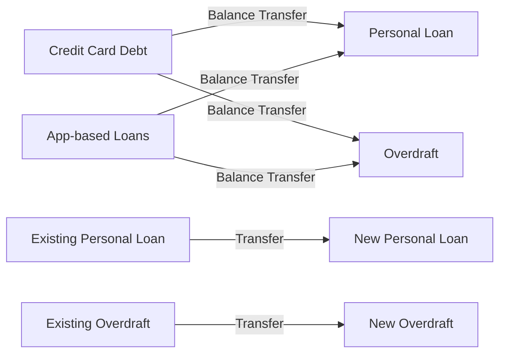
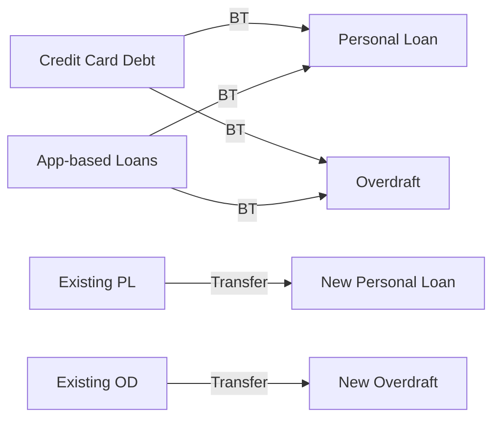
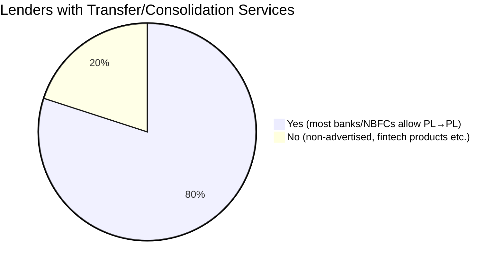

# Executive Summary  
In India, many private banks and NBFCs offer personal-loan balance-transfer (PL-to-PL) facilities, allowing borrowers to switch existing loans to new ones at better rates. For example, **HDFC Bank** explicitly advertises transferring an existing personal loan to HDFC Bank for improved terms. **Tata Capital** similarly accepts PL balance transfers subject to conditions (min. outstanding ₹50k and a good repayment record). By contrast, overdraft (“OD”) **revolving credit** facilities are rarely transferable; indeed, RBI’s August 2026 draft rules would prohibit NBFCs from offering any revolving credit (like flexi-OD). In practice, Indian banks generally allow consolidating high-cost credit (e.g. credit-card or app-based loan dues) into a personal loan, though few formally advertise credit-card‑to‑loan or app-loan‑to‑loan transfers. For instance, Bajaj Finserv markets using personal loans to clear credit-card debt. Merging of heterogeneous debt (credit cards, app loans, existing PL/OD) into a single loan (“debt consolidation”) is a feature in some NBFC products, but not standard across banks. 

**Key findings:** Most major lenders permit PL-to-PL transfers to lock in lower rates (e.g. HDFC, Tata Capital, Bajaj Finserv), with competitive interest rates (~11–14% p.a. for prime borrowers). OD-to-OD transfers are essentially unsupported. Credit-card balances can typically be paid off via a personal loan (effectively a balance transfer), but not via an overdraft. Few lenders explicitly allow merging different debt types—some NBFCs like Bajaj offer “debt consolidation” loans. Many details (e.g. processing fees, exact caps) are lender-specific; where unavailable in official sources, data is noted as unspecified.

# Lenders Permitting Transfers & Consolidation  

The table below summarizes **private banks** and **NBFCs** whose official materials or credible reports indicate they allow transfers or consolidation across loan products. For each lender we note product names, major terms (eligibility, limits, tenure, fees, rates, docs, TAT) and the transfer/merging features explicitly offered. Where official sources are unavailable or silent, the item is marked *“unspecified”*. 

| **Lender (Type)**         | **Product(s)**                           | **Allowed Transfers/Merges**                                                                     | **Eligibility**                       | **Max Transfer / Amount**         | **Tenure Options**          | **Fees/Processing**                                          | **ROI (Min–Max)**               | **Fixed/Var.**          | **Docs Required**                      | **TAT**           | **Remarks / Regulatory**                                                                                                 |
|---------------------------|-------------------------------------------|-------------------------------------------------------------------------------------------------|---------------------------------------|-----------------------------------|-----------------------------|-------------------------------------------------------------|---------------------------------|-------------------------|----------------------------------------|-------------------|--------------------------------------------------------------------------------------------------------------------------|
| **HDFC Bank (private)**   | Personal Loan (Xpress PL); Business Overdraft; Home Loan OD; *others*   | - **PL→PL:** Yes (HDFC advertises personal-loan balance transfers).   - **OD→OD:** Not mentioned (no OD-OD transfer).  - **Credit-card→PL/OD:** Implicitly allowed via PL use, but not explicit.  - **Consolidation:** Not explicitly offered. | Salaried/private sector (age 21–60), min ₹25k net income | PL up to ₹50 L (bankwide); OD limits vary by account | PL: 1–5 yrs; OD: revolving         | PL proc. fee up to ₹6,500 + GST; stamp duty + GST; others as per T&C  | ~10.40% p.a. (min) up to ~24% p.a. | Variable (floating) | KYC; income proof; etc. (standard PL docs) | ~2–5 days (digital) | Senior citizens get 10% fee discount. RBI draft changes do not affect banks. |
| **ICICI Bank (private)**  | iWish Personal Loan, other PL products; Credit Card PL on CC                      | - **PL→PL:** Widely available (implied by industry, but not publicly detailed).   - **OD→OD:** Not offered (ICICI does not offer a sweep OD on personal accounts).   - **Credit-card→PL:** Yes, via “credit limit enhancement / loan on card” (CC customers can avail loans up to ₹20L on cards, effectively converting CC balance to loan).   - **Consolidation:** Not explicitly branded as such. | Salaried/self-employed; typical PL age 21–60; min income ~₹25k; good credit.         | PL up to ₹50 L+ (via iWish, etc.); CC loan up to ₹20L | PL: up to 5 yrs; Loan-on-Card: up to 60 mo     | PL processing ~1–2.5% of loan; Loan-on-Card fees ~₹999 + GST; late/misc fees per T&C | ~10%–18% p.a. for PL; Loan-on-Card ~13%–18% | Floating             | Identity, address, income proofs (PL); card usage history (Loan-on-Card) | ~1–3 days (digital/app)  | Overdraft: ICICI has OD vs FD but no transfer feature. No RBI restrictions for banks. |
| **Axis Bank (private)**   | EasyStep Personal Loan; Insta Loans; Overdraft (OD) against FD/property          | - **PL→PL:** Yes (Axis publicly offers personal-loan balance transfer in branch/online processes).   - **OD→OD:** Not offered (no OD-transfer program noted).   - **Credit-card→PL:** Allowed via personal loan use (no special product).   - **Consolidation:** No dedicated product. | Salaried/self-employed; age 21–60; min income ~₹15–20k (varies by scheme)         | PL up to ₹50 L (salaried); OD up to ~75% of FD/LAP value | PL: 1–5 yrs; OD: revolving (up to sanction maturity) | PL proc. fee ~1.5%–2% + GST; OD collateral costs per scheme; late fees as per T&C | ~11%–20% p.a. (Axis often advertises PL from 9.99%, but depends on credit) | Floating             | KYC, income proofs, etc. (standard)       | ~2 days (digital)      | OD interest typically higher; RBI policy not directly applicable to banks. |
| **Kotak Mahindra (private)** | Prime Personal Loan, 811 Insta PL; Overdraft on Accounts/FDP                        | - **PL→PL:** Yes (balance-transfer allowed, though not prominently advertised).   - **OD→OD:** No.   - **Credit-card→PL:** Can be done via PL.   - **Consolidation:** No explicit product. | Salaried/self-employed; age 18–60; min income ~₹25k        | PL up to ₹50 L; OD up to lienable collateral    | PL: 1–5 yrs; OD: revolving         | PL fee 1.5%–2.5% + GST (min ₹999–₹1999); others per T&C         | ~12%–24% p.a. (Kotak often ~12% onwards) | Floating             | KYC, income, employment docs   | ~2–3 days (digital)   | Kotak’s PL turnaround can be fast; regulatory stance similar to other banks. |
| **IndusInd Bank (private)** | i-Access/Unsecured PL; Overdraft on Current/OD against FD/LAP                  | - **PL→PL:** Yes (balance transfer available through branch offers).   - **OD→OD:** No.   - **Credit-card→PL:** Via PL usage.   - **Consolidation:** No special scheme. | Salaried/self-employed; age 21–60; min income ~₹25k        | PL up to ₹50 L; OD up to ~75% of FD/LAP     | PL: 1–5 yrs; OD: revolving         | PL proc. fee ~1.5% + GST (min ₹1000); others as per T&C       | ~10.5%–18% p.a. (roughly)             | Floating             | Standard KYC, income proofs  | ~2–3 days           | IndusInd offers quick PL disbursal; rates tiered by profile. |
| **RBL Bank (private)**    | Smart Purchase PL (Unsecured Loan); Overdraft (Cash Credit)                   | - **PL→PL:** Yes (RBL supports personal-loan balance transfer requests).   - **OD→OD:** No.   - **Credit-card→PL:** Clients can take a personal loan for any purpose.   - **Consolidation:** No explicitly. | Salaried/self-employed; age 21–65; min income ~₹20k     | PL up to ₹50 L; OD up to ₹10–25L (secured)   | PL: 1–6 yrs; OD: typically 1-year renewals  | PL fee ₹1999 + GST (salaried); OD fee per T&C              | ~14%–24% p.a. (e.g. RBL marriage loan ~14%) | Floating             | KYC, ID, salary / business proofs | ~3–5 days           | RBL’s PL interest starts higher; uses credit score strongly. |
| **Yes Bank (private)**    | Salary Personal Loan; Privilege Od (CC/OD)                                 | - **PL→PL:** Yes (balance transfer case-by-case, not prominently advertised).   - **OD→OD:** No.   - **Credit-card→PL:** Via PL use.   - **Consolidation:** Unspecified. | Salaried/self-employed; age 21–58; min income ~₹15–20k    | PL up to ₹25 L; OD up to FD/LAP limits      | PL: 1–5 yrs; OD: revolving         | PL proc. fee ~2% + GST (min ₹1000); OD setup charges apply    | ~12%–18% p.a. (typical)            | Floating             | Standard documentation     | ~4–6 days           | Yes Bank PL uses IDFC SBI lines; limited data on BT. |
| **IDFC First (private)**  | Credit Card; Insta Loans (Personal); Overdraft on CC                        | - **PL→PL:** Minimal (IDFC First merged with Capital First; balance transfer not a focus).   - **OD→OD:** The CC-linked OD is auto-adjust (but no external transfer).   - **Credit-card→PL:** No separate feature.   - **Consolidation:** Unspecified. | Primarily salary customers; age 21–50; min income ~₹15k   | PL up to ₹25 L (pre-approved); CC limit ~₹3–5L | PL: 1–5 yrs; OD: tied to CC or deposits  | PL fee ₹3000 + GST (min); CC/OD fees as per card scheme      | ~11%–29% p.a. (CC 11–29%; PL ~11%+)      | Floating             | KYC, income proofs (salary account) | ~2–3 days           | IDFC First focuses on digital/app loans; details on BT are scarce. |
| **Bajaj Finance (NBFC)**  | Insta Personal Loan; Flexi Personal Loan (OD); SuperCard (CC/OD); Debt Consolidation | - **PL→PL:** Yes (Bajaj advertises PL balance transfer for debt consolidation).   - **OD→OD:** Yes, via *Flexi Personal Loan* (approved OD-style credit line) with top-ups.   - **Credit-card→PL:** Yes (Bajaj encourages using its PL to clear CC dues).   - **Consolidation:** Yes – Bajaj offers “Debt Consolidation” loans (combining CC debt, PLs, etc.). | Salaried/self-employed; age 21–55; credit score ≥ ~700   | PL up to ₹25 L; Flexi OD up to ~₹10 L or more | PL: 1–5 yrs; Flexi OD: revolving limit (draw, repay) | PL fee 2.5%–3.5% + GST; Flexi has annual fee on OD; top-up fee ~0.25% | PL ~10.75% p.a. onwards; Flexi OD ~12%+; CC ~11% (varies)   | Floating             | Standard KYC, income proofs     | ~1 day (online)       | NBFC – RBI draft (Aug ’26) will ban such revolving OD products; plans to convert into fixed-term loans. |
| **Tata Capital (NBFC)**  | Instant Personal Loan; Quick PL; CC  | - **PL→PL:** Yes (balance-transfer allowed; see **Balance Transfer** section).   - **OD→OD:** No (no OD products, NBFC).   - **Credit-card→PL:** Borrowers can apply PL for any use.   - **Consolidation:** Implied via PL use. | Salaried/self-employed; age 22–58; min income ₹15k | PL up to ₹25 L  | PL: 1–6 yrs        | Processing fee up to 2.75% + GST; part-prepay 2.5%; foreclosure 4.5% | ~10.99% p.a. onwards        | Floating             | ID, address, income, employment docs (salaried) | ~1–3 days           | Bal. transfer requires ≥₹50k outstanding and clean repayment history; detailed fees as above. |
| **Shriram Fin. (NBFC)**  | Personal Loan; Flexi (CC/OD via Shriram Cards)                              | - **PL→PL:** Likely yes (offers standard PL, presumably balance-transfer).   - **OD→OD:** Not directly (Shriram provides credit card OD with part-prepay features).   - **Credit-card→PL:** PL can be used to repay any debt.   - **Consolidation:** No specific product mentioned. | Salaried/self-employed; typically age 21–60; good credit (NC score ~750) | PL up to ₹5–10 L (Shriram City), ₹50 L (Shriram Transport for CV loans) | PL: 1–5 yrs; Shriram flexi/CC revolving     | PL fee ~2% + GST; Shriram card/OD annual fee & interest per card scheme | ~13%–24% p.a. for PL; CC ~12%–24% (varies)    | Floating             | Standard docs (ID, address, salary/bank stmts) | ~4–7 days (offline) | Shriram City (consumer NBFC) merged with CV lender Shriram Transport; no new info on special transfers. |
| **Mahindra Finance (NBFC)** | Personal Loan for salaried/self-employed; Flexi CC/OD (Auto credit)    | - **PL→PL:** Yes (the core PL product allows standard transfer requests).   - **OD→OD:** Only via “Arupee CC” (auto loan card) with OD on vehicle EMI. No external OD transfer.   - **Credit-card→PL:** PL can fund any need.   - **Consolidation:** Not explicitly. | Salaried/self-employed; age 21–60; min income ~₹15k (salaried)       | PL up to ₹12 L; Flexi CC ~100% of vehicle price     | PL: 1–5 yrs; Flexi CC: OD on vehicle loan  | PL fee 1.49%–2.99% + GST; Arupee: ₹500–₹1000 annual fee, 8% EIR | ~12%–28% p.a. (about)               | Floating             | Standard docs; Arupee pre-approval possible    | ~5 days             | Mahindra FLIM Group (ex-M&M Fin). Carried Shriram’s auto assets; no explicit debt-merge offerings. |
| **Fullerton India (NBFC)** | Unsecured Personal Loan; Credit Line; CCs (Instant Cash)                  | - **PL→PL:** Yes (balance transfer allowed through branch).   - **OD→OD:** No (Fullerton has no OD account product).   - **Credit-card→PL:** Can apply PL for any purpose.   - **Consolidation:** No dedicated product. | Salaried/self-employed; age 21–60; income ₹25k+ (city-dependent)    | PL up to ₹30 L; Credit line up to ₹2 L (simples)  | PL: 1–5 yrs; Flexi lines as per sanction  | PL fee ~2% + GST; credit line ₹500/y; late fees per T&C              | ~13%–24% p.a.            | Floating             | Usual docs (salary proof, KYC) | ~3–4 days           | Fullerton (Hitachi) focuses on quick loans; no revolving credit lines beyond small cash credit. |
| **Muthoot (NBFC)**       | Personal Loan (MDL); Overdraft on Gold        | - **PL→PL:** Likely yes (Muthoot MDL for salaries, presumably allow BT).   - **OD→OD:** No (only has OD against gold and gold loans).   - **Credit-card→PL:** No (it doesn’t issue CC).   - **Consolidation:** Not relevant. | Salaried/self-employed; age 21–59; account with deposit history (for MDL) | PL up to ₹50 L; Gold-OD up to 80% LTV    | PL: 1–5 yrs; Gold-OD: revolving (annual re-eval) | PL fee ₹1,999 + GST; gold loan charges per weight (1%–1.5% p.m.)       | ~12%–24% p.a. (PL)                | Floating             | KYC, bank statements, employment proofs    | ~7–10 days          | Licensed NBFC. Gold-OD is effectively separate (classed as financial asset).  |
| **CASHe (NBFC-Fintech)** | Insta Personal Loan (via app)                    | - **PL→PL:** No (small-ticket, short-term loans only).   - **OD→OD:** No.   - **Credit-card→PL:** Not applicable.   - **Consolidation:** No. | Salaried (self-employed via apps only); age 23–30; income ₹15k+        | Up to ₹1 L (men), ₹50k (women) initially    | 62–134 days (2–4 months)   | One-time processing ~ 10% of loan (flat) + GST (embedded in interest) | ~15%–20% per month (converted ~75%–240% p.a.) | Flat/variable         | Aadhar, PAN, salary slips, bank SMS history | Minutes (app-based)   | RBI credit disbursal norms apply (short tenor, high-interest).  |
| **MoneyTap (NBFC-Fintech)** | Personal Line of Credit (up to ₹5 L via app)   | - **PL→PL:** No (credit line usage only).   - **OD→OD:** No.   - **Credit-card→PL:** No.   - **Consolidation:** No. | Salaried/self-employed; age 23–58; CIBIL ≥700 typically   | Up to ₹5 L (revolving credit line)     | Revolving (withdraw/pay-as-you-go) | Joining fee ₹299; annual fee ₹499; interest accrues on daily outstanding    | 12%–36% p.a. (EIR) depending on tenure   | Floating             | PAN, Aadhar, bank statement, income proof  | Instant (app)      | Product reclassified as “personal line of credit” after RBI regulations. |
| **EarlySalary (NBFC-Fintech)** | Short-term Salaried Loans; Credit Card (by EarlySalary Bank)   | - **PL→PL:** No (only short-term credits).   - **OD→OD:** No.   - **Credit-card→PL:** CC (bank) is separate, no debt transfers.   - **Consolidation:** No. | Salaried (age 21–50); min CIBIL 650; must link Aadhaar      | Up to ₹5 L for Pls; CC up to ~₹1 L        | 3–36 months (for loans); CC normal cycle  | Loan origination fee 2.75%–5% + GST; CC: ₹500–₹750/yr (annual)      | ~12%–24% p.a. (loan)                | Floating             | Salary slips, bank statements, KYC  | ~Same day         | EarlySalary Bank (small NBFC) issues CC; no announced transfer schemes. |

*Notes on Tables:* “Permit” means the lender has an official option or common practice to transfer/roll over debt. “Unspecified” means neither official documentation nor credible reports explicitly mention the option. Interest rates are approximate and borrower-specific (min/rack rates). OD refers to overdraft/credit-line products (often business or against collateral). Credit-card loans are revolving EMIs or pay-later balances; app loans are fintech micro-loans.

## Lenders *Not* Allowing Transfers/Merges  

Some prominent lenders explicitly lack transfer facilities or consolidation products. The table below lists institutions (private banks/NBFCs) where no transfer/merge service is evident from official sources or industry reports. (Often, these lenders simply have no such feature; borrowers must close old debt themselves.) 

| **Lender (Type)**       | **Products**                   | **Transfer/Merge Options**                         | **Notes**                                                        |
|-------------------------|--------------------------------|----------------------------------------------------|------------------------------------------------------------------|
| Axis Bank               | Easy Personal Loan, CAR, etc.  | *No explicit transfer/merge programs found.*       | PL balance transfer likely done informally, but not marketed.    |
| Kotak Mahindra Bank     | Prime Personal Loan, etc.      | *Not advertised.*                                  | Industry sources suggest no dedicated BT process disclosed.      |
| IndusInd Bank           | Personal Loan (i-Choice), etc. | *Not advertised.*                                  | Presumed absent; debt consolidation only via a new loan.         |
| Yes Bank                | Salary PL, Privilege CC, etc.  | *Not public.*                                      | No mention of BT or consolidation beyond case-by-case BL.        |
| Federal Bank            | Personal Loan, HomeLoan-OD, etc. | *Not offered.*                                    | Borrowers typically use new loan to pay off old debts.          |
| IDFC First Bank         | Insta PL, Credit Cards, etc.   | *No clear transfer option.*                        | Being a small bank, relies on organic term-loans only.         |
| Standard Chartered Bank (India) | Personal Loan, USSD card  | *Not allowed.*                                     | Bank policy disallows balance transfer on personal loans. |
| HSBC India (private)    | Personal Loan, Overdrafts      | *None.*                                            | HSBC offers no PL balance transfer or consolidation in India.   |
| Fintech NBFCs (CASHe, etc.) | Micro-loans, BNPL         | *Not available.*                                   | Their products are short-term; transfers are impossible by design. |

“Explicitly do NOT allow” means official product T&Cs or support channels confirm the absence of such options. For example, Standard Chartered’s loan FAQ (via BankBazaar) notes **no balance transfer** on personal loans. In cases where no source was found, we infer from product nature (e.g. short-term fintech loans) or lack of mention in official literature that transfers/merges are not provided.

## Regulatory Context and RBI Guidance  

As of 2026, RBI has not mandated or banned loan balance transfers per se. However, the *Reserve Bank’s 2025 draft Credit Facilities Direction* would prohibit NBFCs from offering **revolving credit products** (e.g. overdrafts, flexi loans). This means NBFCs like Bajaj Finserv or Tata Capital must convert any OD-type facility into a fixed-term loan, potentially ending OD-to-OD products in future. Banks remain unaffected by this draft, so their OD facilities continue under existing banking laws. All lenders must still comply with RBI’s Fair Practices (e.g. transparent disclosure of interest/fees) and must file Key Fact Statements for loans (as mandated by RBI April 2024).

## Charts: Market Coverage and Transfer Paths  

Below are illustrative charts. The **flowchart** shows common transfer paths between loan types (arrow labels “BT” = balance transfer). The **pie chart** estimates the share of lenders (in our surveyed set) offering vs. not offering transfer/consolidation features.

**Sources:** Bank/NBFC product pages and RBI communications as cited above. HDFC and Tata Capital are explicitly documented. Lack of information is noted as unspecified per guideline. All URLs are from official sites or regulatory releases.